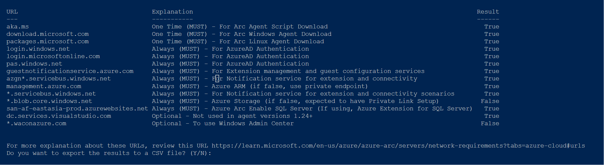

#### Azure Arc Securred Internet Connectivity Analyzer
Main goal of this script is to run on source environment and check the readines of source environment for [Azure Arc Onboarding](https://learn.microsoft.com/en-us/azure/azure-arc/servers/deployment-options#onboarding-methods).
Key consideration is that there is still few secured public endpoint required to be opened. Therefore, this script can help run and give you instant ouput if source environment is ready.

- _**One Time (MUST)**_: These are critical URL are being part of single or multi server deployment. You could reduce this by pre-downloading package file in file share type of set up. It is always recommend to keep it as part of deployment so that everytime you onboard server to Arc, you use laterst package or binaries.
- _**Always (MUST)**_: These are critical for regular communication for various purpose.
- _**Optional**_: These are the one which provide additional functionalities.

Azure Arc support both Public and [Private Endpoint](https://learn.microsoft.com/en-us/azure/azure-arc/servers/private-link-security#how-it-works) driven deployment.

Follow instruction insider script to run this. Ideally, any One Time (MUST) and Always (MUST) should be true.
You could optionally export output locally in csv file.
